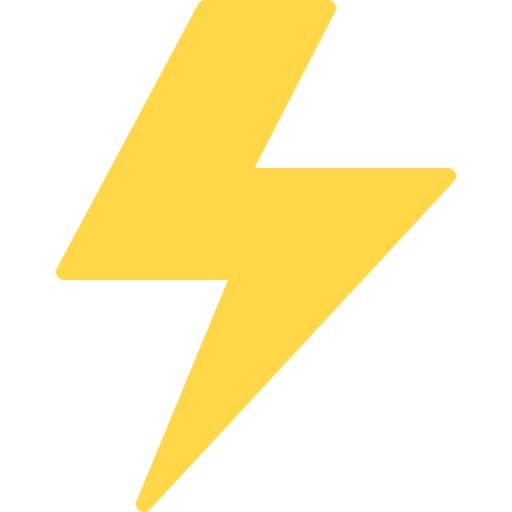

# Bolt 
### A fucking idiot thing that stores data in a key/value format.

## How to build?

To be able to build the binaries, you need to install the Rust and Cargo.

```
$ curl https://sh.rustup.rs -sSf | sh
```

If installation successful, you're be able to build the project.

```
$ cargo build
```

Cargo will create the binaries files `bolt-server` and `bolt-ctl` on path `src/target/debug`

## How to run?

Navigate to `src/target/debug`

```
$ cd src/target/debug
```

And start the server:


```
$ ./bolt-server
   ___  ____  __ ______
  / _ )/ __ \/ //_  __/
 / _  / /_/ / /__/ /   
/____/\____/____/_/
-------------------------------------------------------------
The fucking idiot thing that stores data in key/value format.
-------------------------------------------------------------
    
[2023-08-24T15:12:09Z INFO  bolt_server::server] BOLT is running on 127.0.0.1:2012 ...
```

**BOLT** can store, retrieve and delete data in memory through `bolt-ctl`

To store data you can use the `put` command as follow:

`bolt-ctl put <key> <val>`

Example:

````
$ ./bolt-ctl put customer:payload "{\"name\": \"bolt\"}"
OK! PUT customer:payload {"name": "bolt"}
``````

To retrieve data use the `get` command:

`bolt-ctl get <key>`

Example:

```
$ ./bolt-ctl get customer:payload
OK! GET {"name": "bolt"}
```

To delete a key use the `del` command:

`bolt-ctl del <key>`

Example:

```
$ ./bolt-ctl del customer:payload
OK! DEL customer:payload
```